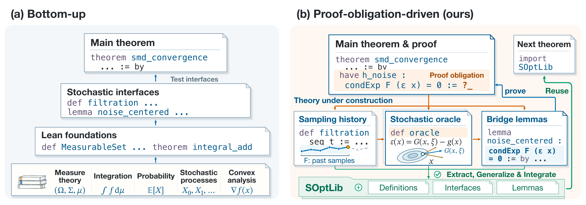
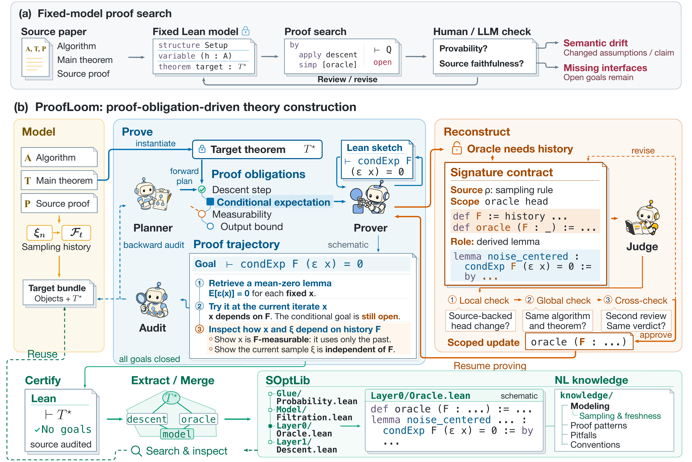
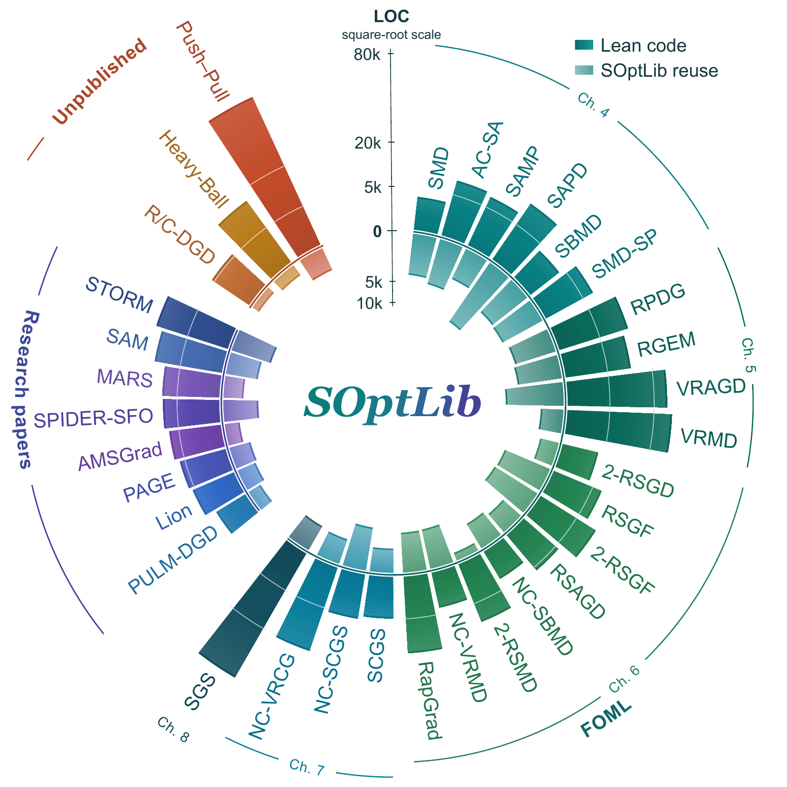

[](https://trace231.github.io/ProofLoom/ "Visit the ProofLoom homepage")

<p align="center">
  <b>Proof-Obligation-Driven Theory Construction<br />
  for Autoformalizing Research-Level Stochastic Optimization</b>
</p>

<p align="center">
  <a href="#the-idea"><picture><source media="(prefers-color-scheme: dark)" srcset="docs/assets/navigation/method-text-dark.svg" /></picture></a>
  <a href="#results"><picture><source media="(prefers-color-scheme: dark)" srcset="docs/assets/navigation/results-text-dark.svg" /></picture></a>
  <a href="formalizations/CATALOG.md"><picture><source media="(prefers-color-scheme: dark)" srcset="docs/assets/navigation/proofs-text-dark.svg" /></picture></a>
  <a href="#start-here"><picture><source media="(prefers-color-scheme: dark)" srcset="docs/assets/navigation/start-text-dark.svg" /></picture></a>
  <a href="docs/TRUST.md"><picture><source media="(prefers-color-scheme: dark)" srcset="docs/assets/navigation/trust-text-dark.svg" /></picture></a>
</p>

A convergence proof can fit on a few pages while relying on a substantial body of
unstated mathematics. Formalizing it requires a model of the algorithm, the proof
itself, and the definitions and lemmas connecting the two.

**ProofLoom starts from the target theorem.** Open Lean obligations determine which
mathematical infrastructure to construct next. Model revisions are checked against
the source, and completed developments contribute reusable mathematics and
construction experience to **SOptLib**.

## The idea



*The target proof exposes the missing definitions, interfaces, and bridge lemmas.
Constructing them also builds the library for the next algorithm.*

Consider stochastic mirror descent. An oracle may be unbiased at every fixed query:

$$
\mathbb{E}_{\xi}[G(x,\xi)] = g(x).
$$

The convergence proof needs a conditional statement at the **random iterate**:

$$
\mathbb{E}[G(x_t,\xi_t)\mid\mathcal{F}_{t-1}] = g(x_t)
\quad\text{almost surely}.
$$

Connecting these statements requires a sampling history, adapted iterates, fresh
samples, and measurability and integrability conditions. The open obligation tells
ProofLoom whether to prove a missing bridge, revise an inadequate interface, or
reconsider the proof route. A derived identity must remain something to prove.

## How ProofLoom works



*Model → Construct → Learn. The figure expands Construct into proof work and
reviewed reconstruction; Learn comprises Certify, Extract, and Merge.*

**Signature contracts keep revisions accountable.** Each proposed interface change
records the affected declarations, the source passage that justifies it, and the
proof obligations it creates. Refactor develops the change; Judge reviews its
assumptions, objects, and downstream dependencies. A fact derived in the source
cannot silently become a new premise.

**Planner–Audit connects the intended argument to the actual proof.** Planner works
forward from the source proof to intermediate claims. Audit works backward through
Lean dependencies to check which claims the target really uses, identify missing
links, and diagnose unnecessary or unsuccessful branches.

**SOptLib retains mathematics and experience.** After certification, Extract and
Merge generalize reusable definitions and lemmas, recheck their use in the original
development, and retain reviewed records of modeling choices, failed routes, and
reuse conditions.

| Library layer | Mathematics to reuse |
| :--- | :--- |
| Glue | Bridges to Mathlib: probability, integration, martingales, and analysis |
| Model | Shared objects: filtrations, stochastic oracles, Bregman divergences, and proximal updates |
| Layer 0 | Problem properties and oracle bounds |
| Layer 1 | Descent, proximal inequalities, telescoping, and complexity bounds |

Lean checks formal derivations. Source correspondence is reviewed separately and
remains a limitation of the method. The diagram describes the intended workflow;
individual artifact boundaries are recorded in [Trust & scope](docs/TRUST.md).

<sub>Read further: <a href="engine/docs/paper_mapping.md">Implementation</a> · <a href="docs/PAPER.md#worked-example-sams-gaussian-kl-bridge">SAM worked example</a> · <a href="soptlib/README.md">SOptLib</a></sub>

## Results

The paper compares seven systems on **15 tasks**: ten algorithms from Lan's
*First-order and Stochastic Optimization Methods for Machine Learning* (FOML), and
five research-paper algorithms — AMSGrad, STORM, SPIDER, PAGE, and SAM.
Each system–task pair receives a cumulative 48-hour generation budget. The five
research-paper tasks share a fixed SOptLib snapshot built from FOML developments.

Mean human ratings assess source faithfulness and proof completeness on a **1–7
scale**; higher is better.

| System | FOML · 10 tasks | Research papers · 5 tasks |
| :--- | ---: | ---: |
| Raw Codex | 2.8 | 2.8 |
| Raw Codex (Goals) | 3.0 | 3.0 |
| OpenGauss | 3.5 | 3.8 |
| LeanMarathon | 4.4 | 4.2 |
| Trellis | 4.5 | 4.8 |
| Archon | 4.9 | 5.0 |
| **ProofLoom** | **6.3** | **6.4** |

ProofLoom also has the highest mean in all 16 combinations of source group,
evaluation protocol, and model judge reported in the paper.

On **43 obstruction cases**, the full system finds a correct diagnosis and a
source-faithful repair direction in 33 cases, compared with 29 when either Judge
or Planner–Audit is removed. Removing Judge increases incorrect repairs from one
to six. These labels concern diagnosis and repair direction, rather than completed
end-to-end proofs.

*These are paper-reported results. The [research notes](docs/PAPER.md) include the
model-evaluation tables, ablation counts, and snapshot scope.*

## What formalization reveals

The paper reports **28 independent source discrepancies across 22 developments**,
including formula errors, proof gaps, and mismatches between algorithms and their
analyses. Two examples illustrate the mathematics behind that count.

**SAM: a premise at one Gaussian scale does not transfer to another.** The source
assumes that perturbing at scale $\rho$ does not decrease population loss, then
uses $\sigma=\rho/[\sqrt{k}(1+\sqrt{\log(n)/k})]$ in the proof. For the smooth bounded loss
$\ell(x)=0.5-0.2\cos x+0.1\cos(2x)$, with $k=1$, $n=16$, and $\rho=2$, the Gaussian
averages are approximately **0.473** at $\rho$ and **0.382** at the selected $\sigma$,
while $\ell(0)=0.4$. The premise holds at the first scale and fails at the second.
The corrected formulation makes the selected-scale premise explicit.

<sub>Source: <a href="formalizations/SAM/Algorithms/Unverified/SAM.lean">SAM.lean</a></sub>

**Variance-reduced mirror descent: a proof step leaves the feasible set.** Lan's
Lemma 5.8 uses a gradient step that can leave $X$, although smoothness is assumed
only on $X$. The formal repair constructs open-domain cocoercivity and a Bregman
bridge on the relative interior, then extends the bound to the boundary. This
route adds an explicit condition: each component gradient's image on the relative
interior is convex.

<sub>Source: <a href="formalizations/VarianceReducedMirrorDescent/README.md">VRMD correction</a></sub>

## Explore the proofs

<p align="center">
  <a href="docs/assets/paper-artifact-atlas.pdf"></a>
</p>

*Lean code and SOptLib reuse across 33 archived developments from the paper.*

<sub><a href="docs/assets/paper-artifact-atlas.pdf">PDF</a> · <a href="docs/assets/paper-artifact-atlas.pptx">Editable PowerPoint</a> · <a href="docs/assets/paper-artifact-atlas-data.json">Figure data</a></sub>

The [proof catalog](formalizations/CATALOG.md) covers all 32 developments. Each
project includes its Lean source, mathematical specification, and complete local
import closure.

| Area | Selected developments |
| :--- | :--- |
| **Stochastic & accelerated** | [Mirror descent](formalizations/StochasticMirrorDescent/) · [Accelerated gradient](formalizations/StochasticAcceleratedGradientDescent/) · [Mirror prox](formalizations/StochasticAcceleratedMirrorProx/) |
| **Variance reduction** | [SPIDER](formalizations/SPIDER/) · [PAGE](formalizations/PAGE/) · [STORM](formalizations/StochasticRecursiveMomentum/) |
| **Adaptive optimization** | [AMSGrad](formalizations/AMSGrad/) · [Lion](formalizations/Lion/) · [MARS](formalizations/MARS/) |
| **Primal–dual & conditional gradient** | [SAPD](formalizations/StochasticAcceleratedPrimalDual/) · [Conditional gradient sliding](formalizations/StochasticConditionalGradientSliding/) |
| **Reusable mathematics** | [SOptLib](soptlib/README.md) |

Project-local libraries preserve the versions each proof needs. Canonical SOptLib
is maintained as a separate snapshot. The [source inventory](formalizations/manifest.json)
records the files in this release.

## Start here

**Requirements:** Linux, Python 3.11+, and Git. Lean and Mathlib versions are pinned.

**1. Inspect the checkout** — offline, without model calls.

```bash
./proofloom check
./proofloom pipeline minimal --dry-run
```

**2. Check a proof** — compile a development or run the small reference example.

```bash
./proofloom proofs --algorithm StochasticMirrorDescent
./proofloom demo
```

First use installs the required dependencies. Full developments can need substantial
memory and build time. See the [installation guide](docs/GETTING_STARTED.md) for
setup and resource controls.

<details>
<summary><b>Run proof generation with your model account</b></summary>

Install and authenticate the configured model CLI, then set its profile in `.env`:

```bash
cp .env.example .env
# Edit .env with your authenticated model CLI profile.
./proofloom pipeline minimal --dry-run
./proofloom pipeline minimal
```

The final command makes model calls and uses your account's quota. Each run creates
an isolated workspace under `engine/.example_runs/` and prints its location.

For custom inputs, PDF preparation, individual stages, and continuation, see the
[usage guide](engine/docs/usage.md). The optional [SPIDER extension example](engine/examples/spider/README.md)
requires a matching PDF supplied by the user.

</details>

## Verification & scope

All 32 developments have **retained successful compilation records** tied to their
source hashes. They describe the supplied source snapshot. Regenerate local build
and dependency reports with:

```bash
./proofloom proofs     # Rebuild the formal developments and inspect dependencies
./proofloom soptlib    # Check the complete canonical library
```

> **A build is not a completeness claim.** SOptLib retains three custom mathematical
> axioms, several developments have additional hypotheses, and SAPD's
> high-probability endpoint remains unfinished.

<details>
<summary><b>Read the proof boundaries</b></summary>

- RGE, RAPP, VRAGD, and VRMD use explicit additional analytical hypotheses.
- SAPD proves a corrected expected-gap result with additional premises; its
  high-probability endpoint is unfinished.
- SAM includes two private expected-error tests with `sorryAx`. No public SAM
  theorem depends on those tests in the retained dependency report.
- Canonical SOptLib retains three custom mathematical axioms and records their
  consumers. Importing an axiom-containing module does not imply every theorem
  uses that axiom.

Fresh checks write local reports under `.build/`. The linked reports below
distinguish compilation, theorem dependencies, and source coverage.

</details>

<sub>Reports: <a href="formalizations/VERIFICATION.md">Verification records</a> · <a href="docs/TRUST.md">Assumptions &amp; scope</a></sub>

## Repository guide

| Path | Contents |
| :--- | :--- |
| [engine/](engine/) | Pipeline, prompts, software tests, and examples |
| [formalizations/](formalizations/CATALOG.md) | Lean developments and source specifications |
| [soptlib/](soptlib/README.md) | Canonical optimization library |
| [scripts/](scripts/) | Setup, integrity checks, and proof verification |
| [docs/](docs/GETTING_STARTED.md) | Installation, release scope, and trust boundaries |

<details>
<summary><b>Developing ProofLoom</b></summary>

```bash
python3 -m venv .venv
source .venv/bin/activate
python -m pip install -r engine/requirements-dev.txt
bash engine/scripts/test_entrypoints.sh
python -m unittest discover -s scripts -p 'test_*.py'
./proofloom check
```

The [contribution guide](CONTRIBUTING.md) covers source inventories, engine changes,
and proof revisions. Distribution details are in [release scope](docs/RELEASE.md).

</details>

---

<p align="center">
  <b>Melon Group · PKU CMLR</b><br />
  <sub>Original project contributions under <a href="LICENSE">MIT</a> · <a href="THIRD_PARTY_NOTICES.md">Third-party notices</a> · <a href="CONTRIBUTING.md">Contributing</a></sub>
</p>
